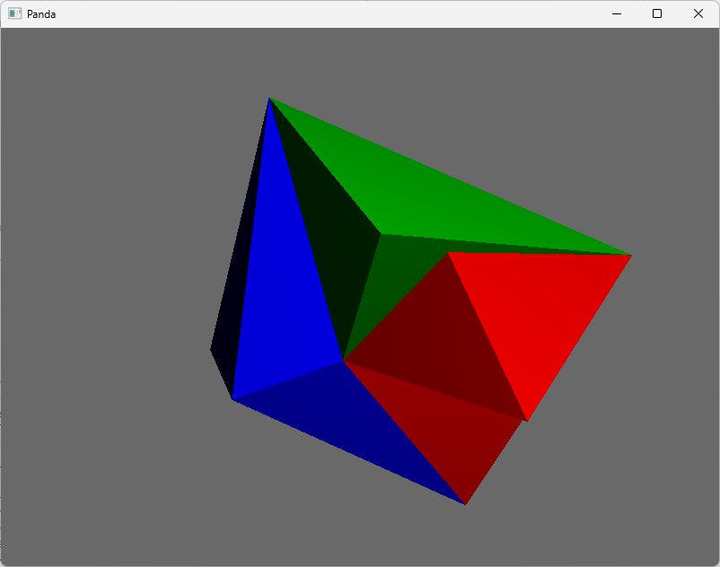

# About
This repository contains my early experiments using python and the [panda3d game engine](https://www.panda3d.org/).
It is one of my first programming projects, and I have abandoned it in 2019.
The idea was to create [Karl-Sims like creatures](https://www.youtube.com/watch?v=JBgG_VSP7f8), but instead of having the bodies be based around cubes, I wanted them to be composed of tetrahedrons.

I implemented the basic code needed to generate a tetrahedron, where each face can be selected to be extended into another tetrahedron, thus composing into a larger body consisting of clean polygons.

Below is a screenshot of one such body:

I still think the premise of Karl-Sims-like creatures composed of tetrahedrons instead of cubes is interesting, and I think panda3d is a capable 3d engine for python.
At the time when I started this project, I had no idea of the scope required to undertake such a project and university soon became a more immediate priority...